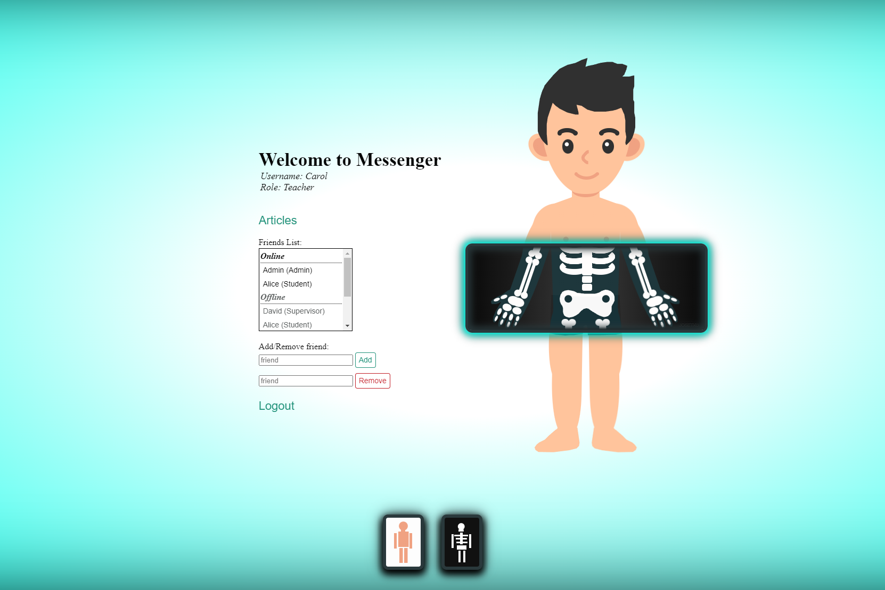
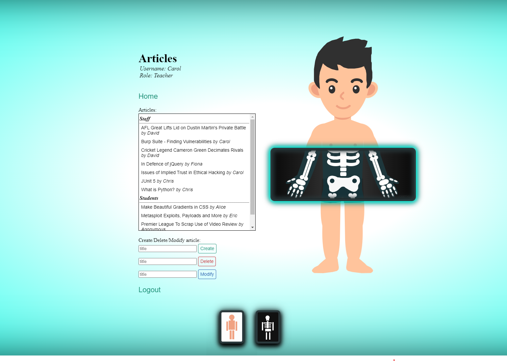
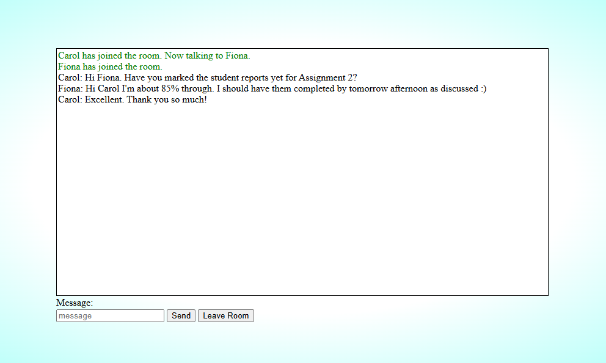
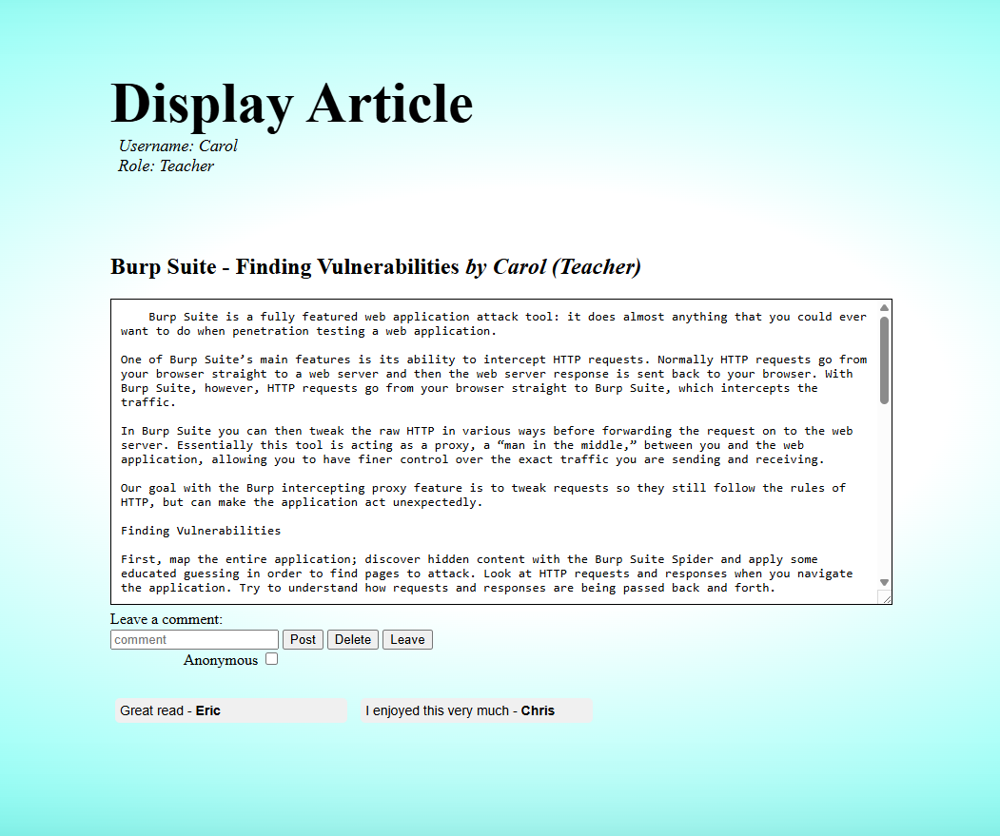

# Messenger App

**A role-based messaging app for academic use.**

Messenger features:
- Friends list
- Chat rooms
- Message history
- Offline messaging
- Article repository
- Comment on articles
- Role-based commands
- Anonymity when posting articles and comments

*See passwords.txt for existing accounts and their sign in details.*

## Roles

Admin:  
- Can chat to anyone (Admin friends list contains every user that signs up).  
- Set/Delete roles for any user.  
- Mute/Unmute any user.  
- Create articles.  
- Modify/Delete articles created by any user.  
- Comment on articles.  
- Delete any comment.  

Staff (Teacher, Teaching Assistant, Supervisor):  
- Can chat with friends.  
- Mute/Unmute Student users.  
- Create articles.  
- Modify/Delete articles created by themselves or by Student users.  
- Comment on articles.  
- Delete comments made by themselves or by Student users.  

Student:  
- Can chat with friends.  
- Create articles.  
- Modify/Delete their own articles.  
- Comment on articles.  
- Delete their own comments.  

## Commands

Type "!" in chat box to see role-specific commands.

Admin Commands:  
- !role set <username> <role>  
- !role delete <username>  
- !mute <username>  
- !unmute <username>  

Staff Commands:  
- !mute <username>  
- !unmute <username>  

*Muted users cannot join chat rooms or post/comment on articles.*

## Setup

To setup, install the packages:

```bash
pip install -r requirements.txt
```

Finally, add the authority certificate (certs/myCA.pem) as a trusted certificate to your internet browser.

## Running the App

To run the app:

```bash
python app.py
```

Navigate to `http://127.0.0.1:5000`

## A Warning
Since cookies are shared across browser tabs, multiple different browsers are required to test client communication.

## Tech Stack
- HTML
- CSS
- Javascript
- Python
- SQLite

## Javascript Dependencies
- Socket.io
- Axios
- JQuery
- Cookies 

## Python Dependencies
- Template Engine: Jinja
- Database ORM: SQL Alchemy (use SQLite instead if you are an SQL master)
- Flask Socket.io

## Screenshots

| | |
|---|---|
|  |  |
|   |  |
